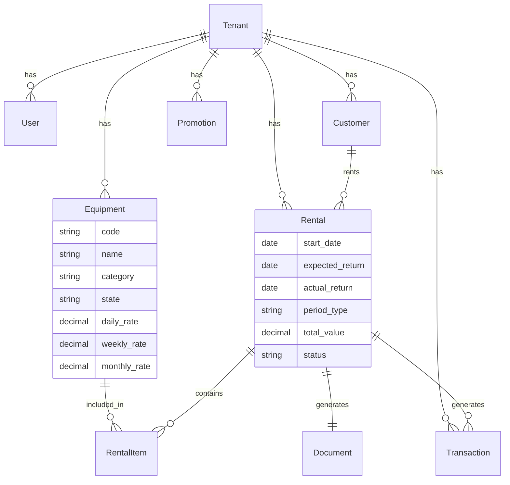

# 📋 Plano de Implementação — LocaMaq

## Problema Statement
Criar uma plataforma SaaS de gestão de locação de máquinas/equipamentos (andaimes, betoneiras, etc.) que permita controle de estoque por unidade, fluxo de caixa básico, emissão de comprovante PDF e comunicação com clientes via WhatsApp.

## Requisitos Consolidados

| Aspecto | Decisão |
|---------|---------|
| Nome | locamaq |
| Stack | Python Django + SQLite |
| Arquitetura | Modular, SOLID, multi-tenant (tenant_id) |
| Deploy | Docker na Hostinger |
| Frontend | Django Templates (SSR) + Bootstrap/Tailwind |
| Estoque | Por unidade com patrimônio, estados e histórico |
| Locação | Período flexível (diária/semanal/mensal) |
| Fluxo de caixa | Básico (entradas/saídas, saldo diário) |
| Comprovante | PDF completo com cláusulas e dados legais |
| Perfis | Admin + Operador |
| WhatsApp | Evolution API, envio manual (notificações + PDF) |
| Promoções | Broadcast manual para clientes, apenas informativo |

## Arquitetura Modular Proposta

```
locamaq/
├── config/                # Settings, URLs raiz, WSGI/ASGI
├── apps/
│   ├── tenants/           # Multi-tenant (empresa, config)
│   ├── accounts/          # Auth, usuários, perfis (Admin/Operador)
│   ├── customers/         # Cadastro de clientes
│   ├── inventory/         # Equipamentos, patrimônio, estados
│   ├── rentals/           # Locações, devoluções, períodos
│   ├── finance/           # Fluxo de caixa (entradas/saídas)
│   ├── documents/         # Geração de PDF (comprovantes)
│   ├── notifications/     # WhatsApp (Evolution API)
│   └── promotions/        # Canal de promoções (broadcast)
├── templates/             # Templates Django + Tailwind
├── static/                # CSS, JS, imagens
├── Dockerfile
├── docker-compose.yml
└── requirements.txt
```

## Diagrama de Domínio



## Task Breakdown

### Task 1: Scaffolding do projeto + Docker + CI base
- **Objetivo:** Criar projeto Django com estrutura modular, configurar SQLite, Dockerfile, docker-compose, e rodar localmente.
- **Implementação:** `django-admin startproject config .`, criar apps vazias, settings com split (base/dev/prod), variáveis de ambiente com `python-decouple`.
- **Teste:** Projeto sobe com `docker-compose up`, acessa página default do Django.
- **Demo:** Container rodando na porta 8000 com página Django padrão.

### Task 2: App tenants + accounts (multi-tenant e autenticação)
- **Objetivo:** Implementar modelo Tenant, User customizado com tenant_id, login/logout, middleware de tenant.
- **Implementação:** AbstractUser com FK para Tenant, middleware que injeta tenant no request, decorators para Admin/Operador, templates de login com Tailwind.
- **Teste:** Testes unitários de criação de tenant/user, teste de middleware, teste de permissões.
- **Demo:** Login funcional, admin vê painel, operador vê painel restrito.

### Task 3: App customers (cadastro de clientes)
- **Objetivo:** CRUD completo de clientes vinculados ao tenant.
- **Implementação:** Model Customer (nome, CPF/CNPJ, telefone/WhatsApp, endereço), views com class-based views, templates com listagem, busca, formulário.
- **Teste:** Testes de model, testes de views (create, update, list, delete), isolamento por tenant.
- **Demo:** Operador cadastra, edita, busca e remove clientes.

### Task 4: App inventory (equipamentos com patrimônio e estados)
- **Objetivo:** CRUD de equipamentos com código patrimônio, categorias, estados e tabela de preços flexível.
- **Implementação:** Models Equipment (code, name, category, state, daily/weekly/monthly_rate), EquipmentHistory (log de mudanças de estado). States: disponível, locado, manutenção, baixado.
- **Teste:** Testes de transição de estado, validações, filtros por categoria/estado.
- **Demo:** Admin cadastra equipamentos, visualiza por estado, filtra por categoria, vê histórico.

### Task 5: App rentals (locações e devoluções)
- **Objetivo:** Fluxo completo de locação — criar, vincular equipamentos, calcular valor, registrar devolução.
- **Implementação:** Models Rental + RentalItem, cálculo automático por período (diária/semanal/mensal), mudança de estado do equipamento ao locar/devolver, validações (não locar equipamento indisponível).
- **Teste:** Testes de cálculo de valor, transição de estados, validação de disponibilidade, devolução parcial.
- **Demo:** Operador cria locação, seleciona cliente e equipamentos, sistema calcula valor, devolução atualiza estoque.

### Task 6: App finance (fluxo de caixa básico)
- **Objetivo:** Registrar entradas (recebimentos) e saídas (despesas), visualizar saldo diário.
- **Implementação:** Model Transaction (type: entrada/saída, value, date, description, rental FK opcional), views de listagem com filtro por período, resumo com saldo.
- **Teste:** Testes de cálculo de saldo, criação automática de entrada ao confirmar pagamento de locação.
- **Demo:** Tela de fluxo de caixa com entradas/saídas do dia, saldo acumulado, filtro por período.

### Task 7: App documents (geração de PDF — comprovante de locação)
- **Objetivo:** Gerar PDF completo do contrato de locação com dados legais.
- **Implementação:** Usar `weasyprint` ou `reportlab`, template HTML→PDF com: dados da empresa, dados do cliente, equipamentos, período, valor, cláusulas de responsabilidade, condições de devolução, multas, campo para assinatura.
- **Teste:** Teste de geração de PDF, verificação de conteúdo, download funcional.
- **Demo:** Ao criar locação, botão "Gerar Comprovante" baixa PDF formatado pronto para impressão A4.

### Task 8: App notifications (WhatsApp via Evolution API)
- **Objetivo:** Envio manual de notificações e comprovante PDF via WhatsApp.
- **Implementação:** Service class para Evolution API (enviar texto, enviar mídia/PDF), botões nas telas de locação ("Enviar comprovante via WhatsApp", "Notificar cliente"), configuração da instância Evolution no tenant.
- **Teste:** Testes unitários do service (mock da API), teste de integração com Evolution API.
- **Demo:** Operador clica botão, cliente recebe mensagem + PDF no WhatsApp.

### Task 9: App promotions (canal de promoções — broadcast)
- **Objetivo:** Admin cria promoção e dispara broadcast para clientes selecionados via WhatsApp.
- **Implementação:** Model Promotion (título, mensagem, imagem opcional, data), tela de criação, seleção de clientes (todos ou filtro), disparo em lote via Evolution API.
- **Teste:** Testes de criação de promoção, seleção de destinatários, mock de envio em lote.
- **Demo:** Admin cria promoção, seleciona clientes, clica "Enviar" — mensagens disparadas via WhatsApp.

### Task 10: Dashboard + polish + deploy
- **Objetivo:** Dashboard com indicadores principais, refinamento de UI, e deploy Docker na Hostinger.
- **Implementação:** Dashboard com: equipamentos por estado, locações ativas, faturamento do mês, alertas de devolução atrasada. Ajustes de UI/UX, responsividade mobile. Configuração docker-compose.prod.yml com Gunicorn + Nginx, volume para SQLite.
- **Teste:** Teste de carga leve, verificação de responsividade, checklist de deploy.
- **Demo:** Sistema completo rodando em container Docker na Hostinger, acessível via domínio, com todas as funcionalidades integradas.
